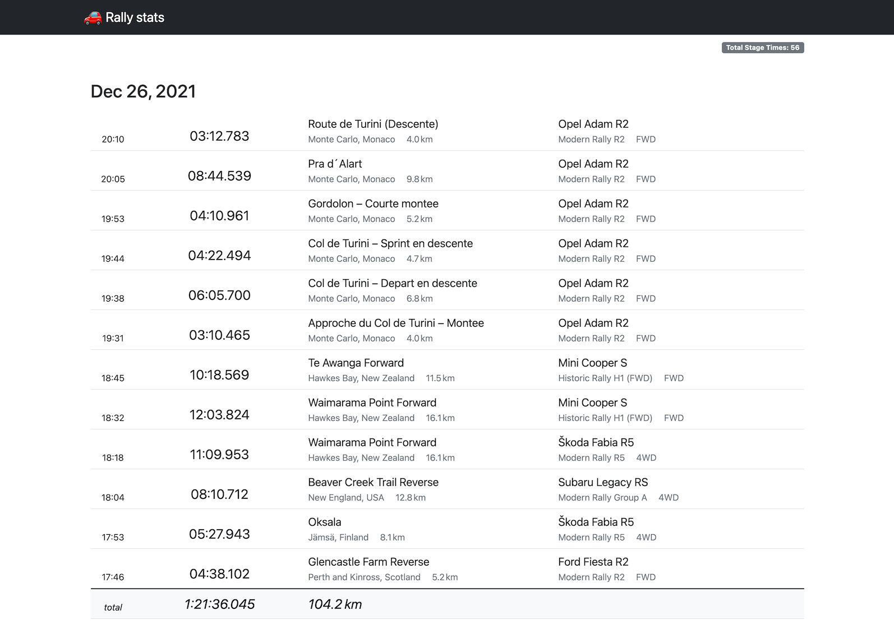

# DiRT Rally 2.0 stats

Web UI with statistics for stage times recorded by
[soong-construction/dirt-rally-time-recorder](https://github.com/soong-construction/dirt-rally-time-recorder)

<table>
<tr>
<td><a href="docs/screens/by-day.png?raw=true" target="_blank"></a></td>
</tr>
</table>

## Configuration

* [configure DiRT Rally telemetry & dirt-rally-time-recorder](https://github.com/soong-construction/dirt-rally-time-recorder#configuration)
* run `timerecord.exe` while you are playing
* download `rstat.exe` from the latest release and drop it to dirt-rally-time-recorder's directory
* run `rstat.exe`
* go to [http://127.0.0.1:58367/](http://127.0.0.1:58367/)

## Development Setup

### Requirements

* Go 1.18+ (beta1 for now)

### Run tests

```
./test.sh
```

### Build

```
./build.sh
```
